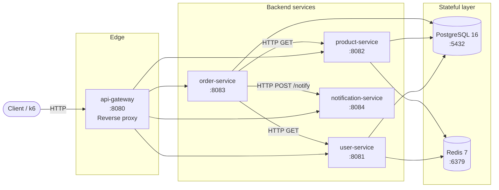
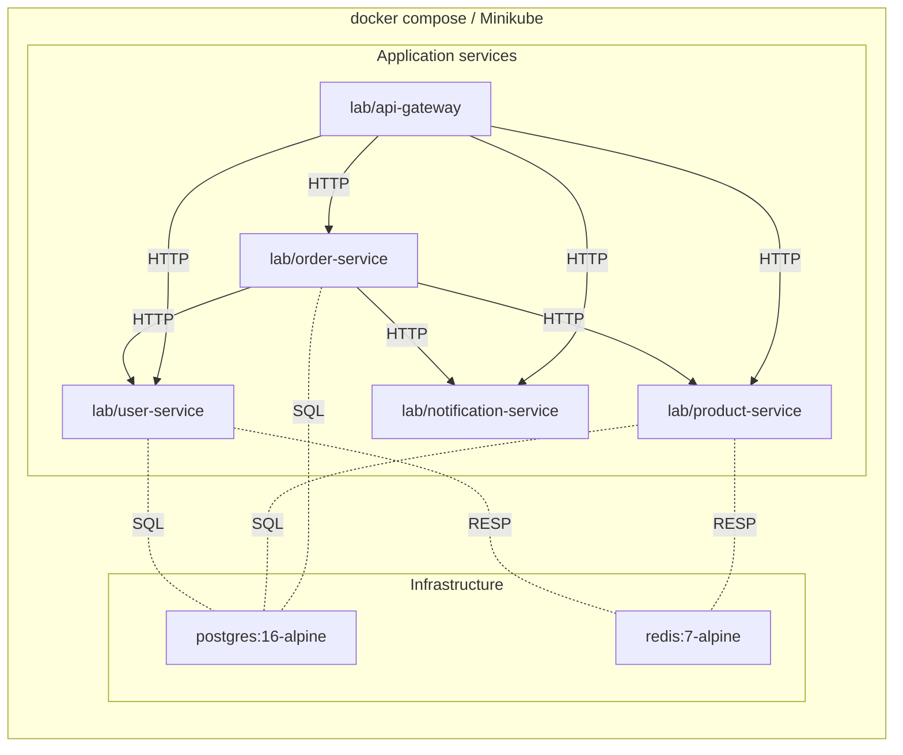
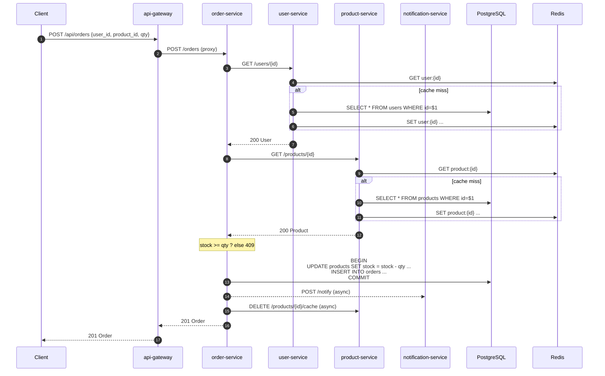
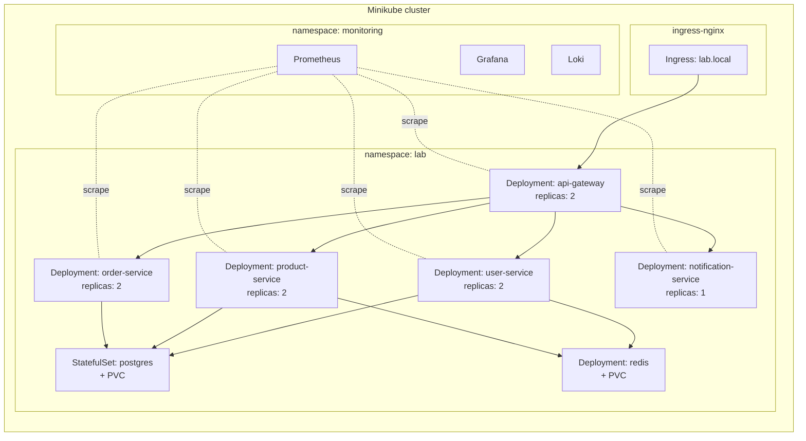

# Backend Performance Lab

A portfolio-grade engineering lab that evaluates the **performance, reliability, scalability, observability, and deployment strategies** of a microservice backend running on Kubernetes.

> This document is the **canonical reference** for the system: what it does (PRD), how it is built (Software Architecture), and how its data is shaped (ERD). For a stage-by-stage runner's guide, see [`RUN.md`](RUN.md).

---

## Table of Contents

1. [Product Requirement Document (PRD)](#1-product-requirement-document-prd)
2. [Software Architecture](#2-software-architecture)
3. [Entity Relationship Diagram (ERD)](#3-entity-relationship-diagram-erd)
4. [Repository Layout](#4-repository-layout)
5. [Tech Stack](#5-tech-stack)
6. [Non-Functional Requirements](#6-non-functional-requirements)
7. [Engineering Experiments](#7-engineering-experiments)

---

## 1. Product Requirement Document (PRD)

### 1.1 Vision

Build a small but realistic **microservices-based commerce backend** whose purpose is **not** business functionality but **engineering decision-making under measurement**. Every architectural choice (image size, replica count, cache TTL, deployment strategy) is evaluated with quantitative experiments and published as engineering blog articles.

The project is positioned for **Backend Engineer / Platform Engineer / SRE / DevOps Engineer** recruiter screens.

### 1.2 Personas

| Persona                            | Goal                                               | Pain point this project addresses                          |
| ---------------------------------- | -------------------------------------------------- | ---------------------------------------------------------- |
| **Hiring manager (Backend / SRE)** | Quickly judge engineering depth                    | Wants to see measurable trade-offs, not "Hello World" CRUD |
| **Recruiter scanning GitHub**      | Skim for evidence of K8s + observability           | Looks for Prometheus, Grafana, k6, Helm in the repo        |
| **Self (the author)**              | Build muscle memory for production-grade reasoning | Needs a sandbox to break things and learn                  |

### 1.3 Scope

**In scope (MVP)**

- 5 REST services: `api-gateway`, `user-service`, `product-service`, `order-service`, `notification-service`
- PostgreSQL as the system of record
- Redis as a write-through cache
- Containerized (Docker) and orchestrated (Kubernetes / Minikube)
- 10 reproducible performance experiments
- Observability stack: Prometheus + Grafana + Loki
- Load testing with k6 (50 → 1000 VUs)
- CI/CD with GitHub Actions

**Out of scope (deliberately)**

- Real authentication (auth is stubbed; no JWT, no OAuth)
- Payment processing
- Real email/SMS delivery (notification service is a logger)
- Multi-region deployment
- gRPC and other protocols (REST only)
- Frontend UI

### 1.4 Functional Requirements

| ID   | Requirement                                                                                                                     |
| ---- | ------------------------------------------------------------------------------------------------------------------------------- |
| FR-1 | `user-service` exposes CRUD over `/users` with email uniqueness                                                                 |
| FR-2 | `product-service` exposes CRUD over `/products` with stock management                                                           |
| FR-3 | `order-service` accepts an order, validates user + product via upstream HTTP, atomically decrements stock and creates the order |
| FR-4 | `order-service` fires a non-blocking notification on success                                                                    |
| FR-5 | `notification-service` accepts `POST /notify` and records the payload                                                           |
| FR-6 | `api-gateway` reverse-proxies `/api/users/*` → user-service, etc.                                                               |
| FR-7 | Every service exposes `GET /healthz` and `GET /metrics`                                                                         |
| FR-8 | User and product reads are served from Redis when fresh; cache is invalidated on write                                          |
| FR-9 | Insufficient stock returns `409 Conflict` without overselling (transactional check)                                             |

### 1.5 Non-Functional Requirements

| ID    | Category        | Target                                                                         |
| ----- | --------------- | ------------------------------------------------------------------------------ |
| NFR-1 | Latency         | p95 < 50 ms for cached reads, p95 < 200 ms for uncached reads at 100 VUs       |
| NFR-2 | Throughput      | Sustain 500 RPS on `/api/products` with HPA enabled                            |
| NFR-3 | Availability    | Survive single-pod failure without data loss (multi-replica + rolling updates) |
| NFR-4 | Scalability     | Linear scaling up to 8 replicas (measured in Experiment 3)                     |
| NFR-5 | Observability   | All services expose Prometheus metrics; logs are JSON and shippable to Loki    |
| NFR-6 | Security        | Distroless images in production; no shell in running containers                |
| NFR-7 | Reproducibility | Every experiment is a single shell script; CSV outputs are committed           |
| NFR-8 | Portability     | Runs identically on Docker Compose (dev) and Minikube (prod)                   |

### 1.6 Success Metrics

- 10 experiment result files (`benchmarks/expXX/results.md`) committed
- 10 blog articles drafted (`docs/blog/expXX-*.md`)
- `make benchmark` runs the full sweep in < 30 min
- A reader can clone the repo and reproduce any single experiment in < 5 min

### 1.7 Milestones

| Milestone | Description                                                      | Stage |
| --------- | ---------------------------------------------------------------- | ----- |
| M1        | Local Postgres + Redis up, schema seeded                         | 1     |
| M2        | 5 Go services with REST APIs, all healthy, end-to-end order flow | 2     |
| M3        | 4 image variants per service, all serve `/healthz`               | 3     |
| M4        | All services deployed on Minikube, ingress routed                | 4     |
| M5        | Single hostname via NGINX Ingress, TLS-ready                     | 5     |
| M6        | Prometheus, Grafana, Loki, dashboards in place                   | 6     |
| M7        | Experiments 1–10 complete with `results.md`                      | 7     |
| M8        | k6 load scripts + sweep runner                                   | 8     |
| M9        | GitHub Actions pipeline green on `main`                          | 9     |
| M10       | All 10 blog articles published                                   | 10    |

---

## 2. Software Architecture

### 2.1 High-Level View



**Key design decisions**

- **Single entry point.** All client traffic hits `api-gateway`. No service is reachable from outside the cluster in production.
- **Synchronous inter-service calls.** `order-service` calls `user-service` and `product-service` over HTTP. This is intentional: it exercises the network in load tests and makes latency observable.
- **Per-service database access.** Each of the three data-owning services has its own connection pool against a **shared** Postgres instance. (Sharding is out of scope for the lab.)
- **Cache locality.** Redis is shared, but the cache keys are namespaced per service (`user:*`, `product:*`).

### 2.2 Container View



Each service is published as **4 image variants** (`single`, `multi-alpine`, `distroless`, `distroless-static`) — see `docker/variants/`. The default deployment uses `multi-alpine`; the API gateway uses `distroless-static` for the smallest attack surface.

### 2.3 Component Responsibilities

| Service                | Owns                                                               | Talks to                                        | Endpoints                                                           |
| ---------------------- | ------------------------------------------------------------------ | ----------------------------------------------- | ------------------------------------------------------------------- |
| `api-gateway`          | Routing, request tagging                                           | All 4 backends                                  | `GET /healthz`, `ANY /api/*`                                        |
| `user-service`         | `users` table (CRUD), `user:*` cache                               | Postgres, Redis                                 | `GET/POST/PUT/DELETE /users[/:id]`                                  |
| `product-service`      | `products` table (CRUD), `product:*` cache, stock decrement        | Postgres, Redis                                 | `GET/POST/PUT/DELETE /products[/:id]`, `DELETE /products/:id/cache` |
| `order-service`        | `orders` table, order orchestration, transactional stock decrement | Postgres, HTTP to user + product + notification | `GET/POST /orders[/:id]`                                            |
| `notification-service` | Notification log                                                   | none                                            | `POST /notify`, `GET /healthz`                                      |

### 2.4 Cross-Cutting Concerns

| Concern          | Implementation                                               | Location                   |
| ---------------- | ------------------------------------------------------------ | -------------------------- |
| HTTP server      | `gin` with graceful shutdown, 5/10 s timeouts                | `pkg/httpserver`           |
| Postgres         | `pgxpool` (10 conns, 1 h lifetime)                           | `pkg/db`                   |
| Redis            | `go-redis/v9`, write-through, TTL = 5 m                      | `pkg/redisx`, `services/*` |
| Metrics          | `prometheus/client_golang`, custom histograms + counters     | `pkg/observability`        |
| Logging          | `slog` JSON to stdout, 1 line per request via Gin middleware | `pkg/observability`        |
| Config           | `os.Getenv` with sensible defaults (no config files)         | `services/*/helpers.go`    |
| Service identity | `X-Service` response header per service                      | `pkg/httpserver`           |

### 2.5 Request Flow: Create an Order



### 2.6 Deployment Topology (Minikube)



### 2.7 Why This Architecture

| Choice                                                  | Rationale                                                 | Trade-off accepted                                    |
| ------------------------------------------------------- | --------------------------------------------------------- | ----------------------------------------------------- |
| Microservices over monolith                             | Lets us measure per-service scaling and failure isolation | More network calls, more deploy units                 |
| REST over gRPC                                          | Familiar, easy to load-test with k6                       | Slightly higher latency than gRPC                     |
| Sync HTTP for inter-service                             | Models real production (Stripe-like fan-out)              | Cascading failures need circuit breakers (not in MVP) |
| Postgres over NoSQL                                     | Demonstrates index optimization (Experiment 6)            | Vertical scaling ceiling                              |
| Redis over in-process cache                             | Cache survives pod restarts, shared between replicas      | One more network hop                                  |
| Reverse-proxy gateway over service mesh (Istio/Linkerd) | Simpler; we can still study routing, but no mTLS in MVP   | Mesh features (retries, circuit breaking) are manual  |

---

## 3. Entity Relationship Diagram (ERD)

### 3.1 Diagram

```mermaid
erDiagram
    USERS ||--o{ ORDERS : "places"
    PRODUCTS ||--o{ ORDERS : "appears in"

    USERS {
        BIGSERIAL id PK
        VARCHAR(255) email UK
        VARCHAR(255) name
        TIMESTAMPTZ created_at
        TIMESTAMPTZ updated_at
    }

    PRODUCTS {
        BIGSERIAL id PK
        VARCHAR(64) sku UK
        VARCHAR(255) name
        NUMERIC(12,2) price
        INTEGER stock
        TIMESTAMPTZ created_at
        TIMESTAMPTZ updated_at
    }

    ORDERS {
        BIGSERIAL id PK
        BIGINT user_id FK
        BIGINT product_id FK
        INTEGER qty
        NUMERIC(12,2) total
        VARCHAR(32) status
        TIMESTAMPTZ created_at
    }
```

### 3.2 Cardinality and Constraints

| Relationship          | Cardinality | FK action            |
| --------------------- | ----------- | -------------------- |
| `users` → `orders`    | one-to-many | `ON DELETE RESTRICT` |
| `products` → `orders` | one-to-many | `ON DELETE RESTRICT` |

| Constraint                                              | Where      | Why                                        |
| ------------------------------------------------------- | ---------- | ------------------------------------------ |
| `users.email UNIQUE`                                    | `users`    | Login / lookup (not implemented in MVP)    |
| `products.sku UNIQUE`                                   | `products` | Business identifier                        |
| `products.price >= 0`                                   | `products` | Domain rule                                |
| `products.stock >= 0`                                   | `products` | Domain rule                                |
| `orders.qty > 0`                                        | `orders`   | Domain rule                                |
| `orders.total` derived from `qty * price` at write time | `orders`   | Snapshot for audit; price may change later |

### 3.3 Indexes (initial set)

| Table      | Index                   | Used by                                             |
| ---------- | ----------------------- | --------------------------------------------------- |
| `users`    | `email` UNIQUE          | natural                                             |
| `products` | `sku` UNIQUE            | natural                                             |
| `orders`   | `idx_orders_user_id`    | `GET /api/users/:id/orders` (not in MVP — reserved) |
| `orders`   | `idx_orders_product_id` | reporting queries                                   |

> **Experiment 6** will add/drop `created_at` and composite indexes and compare `EXPLAIN ANALYZE` plans.

### 3.4 Seed Data

Loaded by `configs/postgres/init.sql` on first start (only when tables are empty):

- `users`: 10 rows (`user1@lab.local` … `user10@lab.local`)
- `products`: 20 rows with random price (5–105) and stock (10–210)

This gives every load-test scenario enough warm data to hit cache and DB meaningfully without a separate fixture step.

### 3.5 DDL (canonical, idempotent)

```sql
CREATE TABLE IF NOT EXISTS users (
    id         BIGSERIAL PRIMARY KEY,
    email      VARCHAR(255) UNIQUE NOT NULL,
    name       VARCHAR(255) NOT NULL,
    created_at TIMESTAMPTZ NOT NULL DEFAULT NOW(),
    updated_at TIMESTAMPTZ NOT NULL DEFAULT NOW()
);

CREATE TABLE IF NOT EXISTS products (
    id         BIGSERIAL PRIMARY KEY,
    sku        VARCHAR(64)  UNIQUE NOT NULL,
    name       VARCHAR(255) NOT NULL,
    price      NUMERIC(12,2) NOT NULL CHECK (price >= 0),
    stock      INTEGER NOT NULL DEFAULT 0 CHECK (stock >= 0),
    created_at TIMESTAMPTZ NOT NULL DEFAULT NOW(),
    updated_at TIMESTAMPTZ NOT NULL DEFAULT NOW()
);

CREATE TABLE IF NOT EXISTS orders (
    id          BIGSERIAL PRIMARY KEY,
    user_id     BIGINT NOT NULL REFERENCES users(id)    ON DELETE RESTRICT,
    product_id  BIGINT NOT NULL REFERENCES products(id) ON DELETE RESTRICT,
    qty         INTEGER NOT NULL CHECK (qty > 0),
    total       NUMERIC(12,2) NOT NULL,
    status      VARCHAR(32) NOT NULL DEFAULT 'pending',
    created_at  TIMESTAMPTZ NOT NULL DEFAULT NOW()
);

CREATE INDEX IF NOT EXISTS idx_orders_user_id    ON orders(user_id);
CREATE INDEX IF NOT EXISTS idx_orders_product_id ON orders(product_id);
```

---

## 4. Repository Layout

```
backend-performance-lab/
├── readme.md                # this file — PRD, Architecture, ERD
├── RUN.md                   # stage-by-stage runner's guide
├── docker-compose.yml       # full local stack (dev overlay)
├── go.mod / go.sum          # single Go module for all services
│
├── docs/                    # architecture diagrams, ADRs, blog drafts
├── benchmarks/              # experiment results (exp01/, exp02/, ...)
│   └── exp01/               # image optimization experiment
├── load-tests/              # k6 scripts (smoke, 50, 100, 300, 500, 1000 VUs)
├── dashboards/              # Grafana dashboards (JSON)
├── kubernetes/              # K8s manifests and overlays
│   ├── base/                # postgres, redis, services
│   └── overlays/{dev,prod}
├── docker/                  # per-service Dockerfiles + 4 variant templates
│   ├── variants/            # Dockerfile.single, .multi-alpine, .distroless, .distroless-static
│   ├── user-service/        # dev Dockerfile (multi-alpine)
│   ├── product-service/
│   ├── order-service/
│   ├── notification-service/
│   └── api-gateway/
├── scripts/                 # bash automation
│   ├── up.sh / down.sh / nuke.sh / smoke.sh
│   ├── smoke-images.sh      # Stage 3 checkpoint
│   ├── build-images.sh      # builds all 20 image variants
│   ├── measure-images.sh    # measures size / startup / RSS
│   └── experiments/         # one runner per experiment
│       └── exp01-images.sh
├── pkg/                     # shared Go packages
│   ├── httpserver/          # gin bootstrap + graceful shutdown
│   ├── db/                  # pgxpool helper
│   ├── redisx/              # go-redis helper
│   ├── httpx/               # small HTTP client
│   └── observability/       # prometheus + slog
├── services/                # one directory per microservice
│   ├── api-gateway/         # reverse proxy
│   ├── user-service/        # CRUD + cache
│   ├── product-service/     # CRUD + cache + stock
│   ├── order-service/       # orchestration + tx
│   └── notification-service/# stub
├── configs/                 # postgres init SQL, env example
├── .github/workflows/       # CI/CD pipeline
└── .env (gitignored)        # local secrets / ports
```

---

## 5. Tech Stack

| Layer         | Choice                        | Why                                                           |
| ------------- | ----------------------------- | ------------------------------------------------------------- |
| Language      | Go 1.22                       | Standard for backend / SRE roles; fast compile, static binary |
| HTTP          | Gin                           | Lightweight, middleware ecosystem, well-known                 |
| DB            | PostgreSQL 16                 | Mature, real-world, index optimization surface                |
| Cache         | Redis 7                       | Industry default, supports TTL, LRU eviction                  |
| Container     | Docker 24+ + BuildKit         | Multi-stage builds, layer caching                             |
| Orchestration | Kubernetes (Minikube locally) | Industry standard; allows deployment-strategy experiments     |
| Observability | Prometheus + Grafana + Loki   | CNCF standard trio                                            |
| Load testing  | k6                            | Scriptable, JSON output, Grafana-friendly                     |
| CI/CD         | GitHub Actions                | Free, ubiquitous, easy to demo                                |

---

## 6. Non-Functional Requirements (recap)

| Area                           | Target                                           | Where measured      |
| ------------------------------ | ------------------------------------------------ | ------------------- |
| Image size                     | `distroless-static` ≤ 20 MB                      | `benchmarks/exp01/` |
| Cold start                     | < 2 s for any variant                            | `benchmarks/exp01/` |
| Memory (steady state)          | < 20 MB per pod                                  | `benchmarks/exp01/` |
| Cache hit ratio (steady state) | > 80 % at 100 VUs                                | Experiment 5        |
| Read p95 latency               | < 50 ms (cached), < 200 ms (uncached) at 100 VUs | Experiment 5, 8     |
| Write p95 latency              | < 250 ms at 100 VUs                              | Experiment 5, 7     |
| Pod restart on rolling update  | 0 failed requests                                | Experiment 7        |
| MTTR (manual)                  | < 5 min via `kubectl rollout undo`               | manual drill        |

---

## 7. Engineering Experiments

Each experiment follows the same template (Objective → Background → Methodology → Environment → Variables → Metrics → Measurement → Expected → Analysis → Trade-offs → Conclusion).

| #   | Experiment                                                                            | Output              |
| --- | ------------------------------------------------------------------------------------- | ------------------- |
| 1   | Docker Image Optimization (single vs multi-alpine vs distroless vs distroless-static) | `benchmarks/exp01/` |
| 2   | CPU / Memory requests & limits                                                        | `benchmarks/exp02/` |
| 3   | Replica scaling (1, 2, 4, 8)                                                          | `benchmarks/exp03/` |
| 4   | HPA vs no HPA                                                                         | `benchmarks/exp04/` |
| 5   | Redis cache (off, on, TTLs)                                                           | `benchmarks/exp05/` |
| 6   | Postgres index optimization (no idx, single, composite)                               | `benchmarks/exp06/` |
| 7   | Deployment strategies (Rolling, Recreate, Blue/Green)                                 | `benchmarks/exp07/` |
| 8   | Networking (NodePort vs Ingress vs LB)                                                | `benchmarks/exp08/` |
| 9   | Observability coverage                                                                | `benchmarks/exp09/` |
| 10  | CI/CD pipeline timing                                                                 | `benchmarks/exp10/` |

Every experiment produces a `results.md` and a `blog.md` (Stage 10).

---

## License

MIT — see `LICENSE`.
